# Investment Tracker V2

A comprehensive portfolio tracking system built with Python and Streamlit for tracking Indian stocks, US stocks, mutual funds, and **crypto/DeFi positions** with monthly snapshots, real-time pricing, and detailed analytics.

<div align="center">

|          |                                                                                                                                                                                                                                                                                                                                                                     |
|----------|---------------------------------------------------------------------------------------------------------------------------------------------------------------------------------------------------------------------------------------------------------------------------------------------------------------------------------------------------------------------|
| Details  |                                                                                                                                                            |
| Stack    |     |
| Tools    |                                                                               |
| Database |                                                                                                                                                                                         |
| Crypto   |                                                                                        |

</div>

## Table of Contents

- [Screenshots](#screenshots)
- [Features](#features)
- [Key Highlights](#key-highlights)
- [How It Works](#how-it-works)
- [Tech Stack](#tech-stack)
- [Quick Start](#quick-start)
- [Testing the Application](#testing-the-application)
- [Project Structure](#project-structure)
- [Database Schema](#database-schema)
- [Supported File Formats](#supported-file-formats)
- [Development](#development)
- [Troubleshooting](#troubleshooting)
- [Future Enhancements](#future-enhancements)

## Screenshots

> **⚠️ DISCLAIMER**: The portfolio values shown in these screenshots are **completely fictional dummy data** generated for demonstration purposes. I'm still broke as hell 😭. If I actually had ₹3M in investments, I wouldn't be writing README files at 2 AM. These numbers are about as real as my chances of retiring early. Please don't report me to the tax authorities - my real portfolio is just tears and regret.

### Dashboard
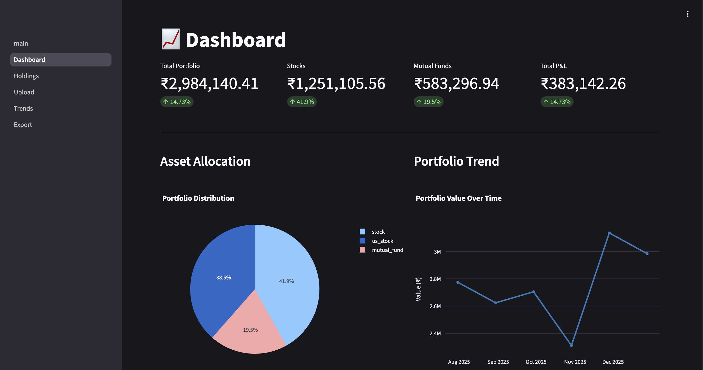
*Main dashboard showing portfolio value, asset allocation, and key metrics*

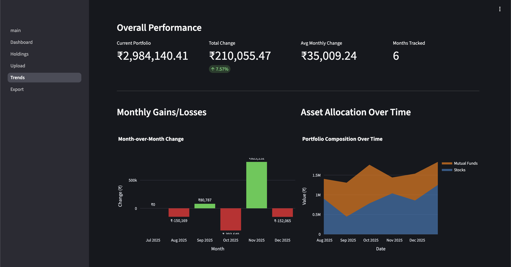
*Performance tracking with detailed charts and trends*

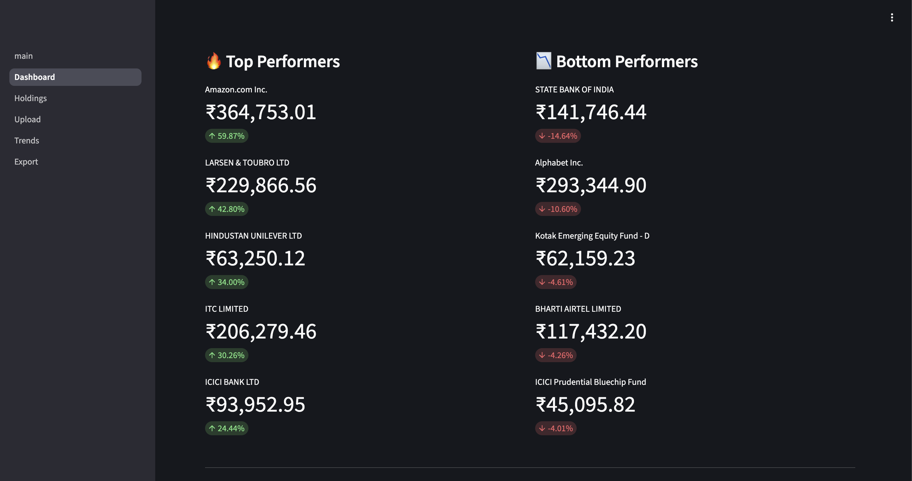
*Best and worst performing holdings at a glance*

### Holdings Management
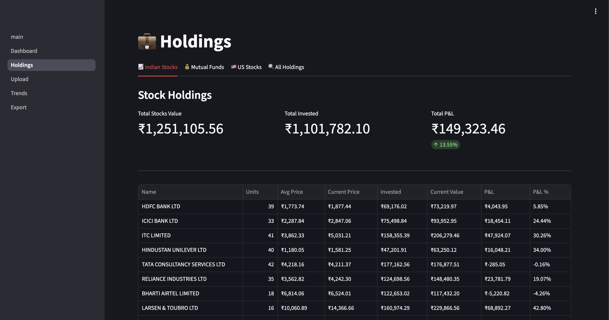
*Indian stocks holdings with real-time valuation*

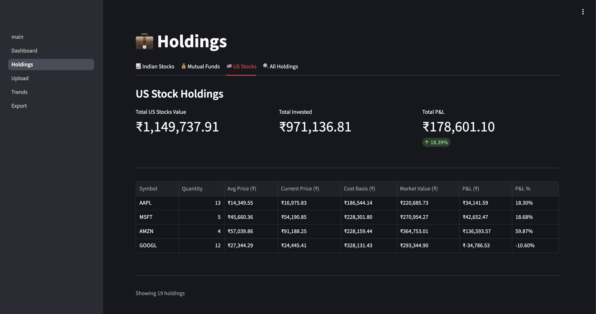
*US stocks portfolio with automatic USD to INR conversion*

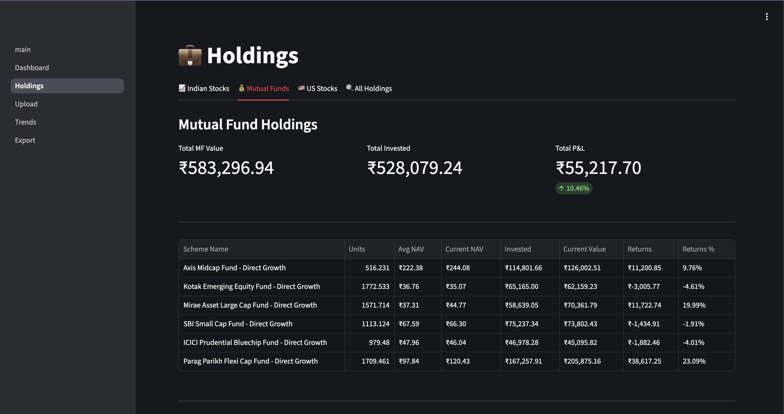
*Mutual funds tracking with NAV updates*

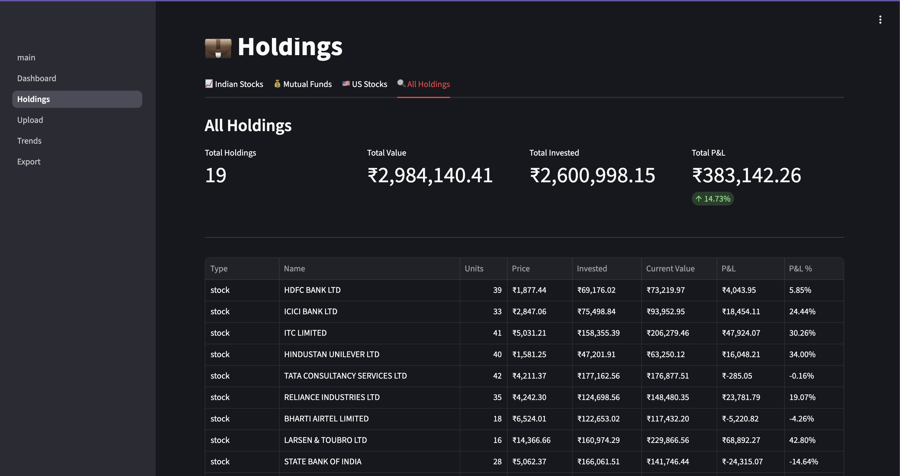
*All holdings in one unified view*

### Data Management

*Easy upload interface for monthly portfolio data*

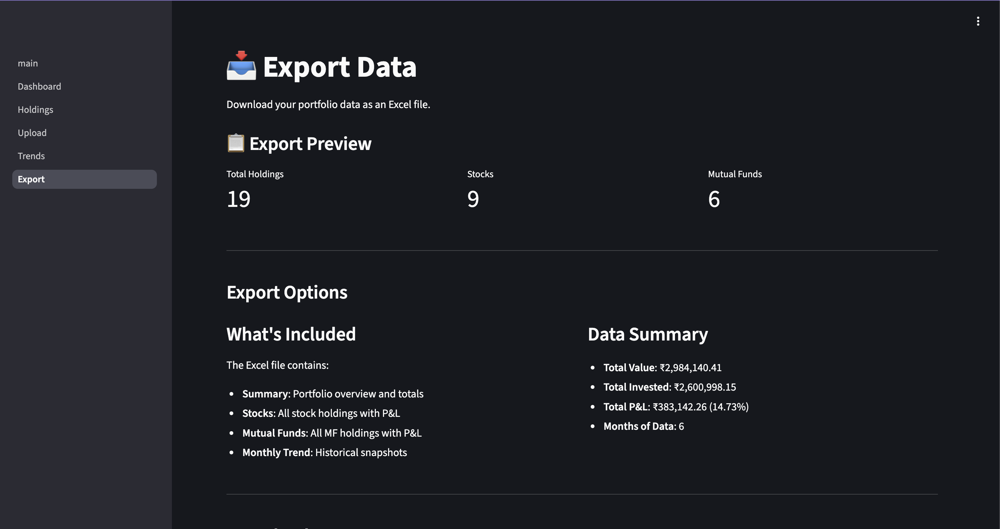
*Export your portfolio data to Excel*

## Features

- **Dashboard**: Portfolio overview with KPIs, charts, and performance metrics
- **Holdings**: Detailed view of Indian stocks, US stocks, and mutual funds
- **Trends**: Historical portfolio value tracking with 6-month visualization
- **Upload**: Easy monthly data import from Excel files (supports 3 asset types)
- **Export**: Generate comprehensive Excel reports
- **Real-time Pricing**: Integration with Yahoo Finance for live stock prices
- **Currency Conversion**: Automatic USD to INR conversion for US stocks
- **Benchmarking**: Compare against Nifty 50 and Sensex
- **Smart Merge**: Upload new data without overwriting existing holdings
- **Crypto/DeFi Tracking**: Live wallet scanning for DeFi positions across Ethereum, Base, Arbitrum, Optimism, Polygon
- **Multi-Protocol Support**: Aave, Compound, Uniswap, Lido, and more via crypto-portfolio-tracker
- **Wallet Management**: Add, remove, and manage multiple Ethereum wallet addresses

## Tech Stack

- **Backend**: Python 3.11+
- **Framework**: Streamlit
- **Database**: SQLite with SQLAlchemy ORM
- **Package Manager**: uv
- **Charts**: Plotly
- **Deployment**: Docker

## Key Highlights

✨ **Multi-Asset Support**: Track Indian stocks, US stocks, and mutual funds in one place
💱 **Smart Currency Conversion**: Automatic real-time USD to INR conversion for US stocks
📊 **Rich Analytics**: 6-month trends, top performers, asset allocation, and benchmark comparison
🔄 **Smart Merge**: Upload new data without overwriting existing holdings
📤 **Export Ready**: Generate comprehensive Excel reports with all portfolio data
🎯 **Privacy First**: Local database, no cloud dependencies, your data stays with you
🔗 **DeFi Integration**: Track Aave, Compound, Lido positions with live on-chain scanning

## How It Works

### Currency Conversion (US Stocks)
When you upload US stocks data from DriveWealth:
1. **Real-time Exchange Rate**: Fetches current USD/INR rate from Yahoo Finance (`USDINR=X` ticker)
2. **Automatic Conversion**: Converts all USD values (prices, invested value, current value) to INR during parsing
3. **Caching**: Rate is cached for 5 minutes to reduce API calls
4. **Fallback**: Uses ₹83.00/USD if API is unavailable
5. **Consistent Display**: All portfolio values displayed in INR across the application

**Example:** MSFT stock at $108.51 with exchange rate 90.17 INR/USD → Stored as ₹9,784.35

### Smart Merge Logic
When uploading to an existing snapshot date:
1. **Selective Deletion**: Only deletes holdings of the asset types you're uploading
2. **Preservation**: Keeps holdings of other asset types intact
3. **Merge**: Combines existing holdings with new uploads
4. **Recalculation**: Updates snapshot summary with all combined holdings

**Example Scenario:**
- Existing data (Jan 10): 25 Indian stocks, 13 Mutual funds, 12 US stocks
- Upload: New US stocks file (15 holdings)
- Result: 25 Indian stocks ✓, 13 Mutual funds ✓, 15 US stocks (updated) = 53 total holdings

## Quick Start

### Prerequisites

- Python 3.11 or higher
- [uv](https://github.com/astral-sh/uv) package manager
- Docker (optional, for containerized deployment)

### Crypto/DeFi Tracking Setup (Optional)

To enable crypto portfolio tracking, you need:

1. **Infura Project ID** (free tier available):
   - Sign up at [infura.io](https://infura.io/)
   - Create a new project
   - Copy the Project ID

2. **Etherscan API Keys** (free, for contract ABIs):
   - [Etherscan](https://etherscan.io/apis) - Ethereum mainnet
   - [Basescan](https://basescan.org/apis) - Base chain
   - [Arbiscan](https://arbiscan.io/apis) - Arbitrum
   - [Optimistic Etherscan](https://optimistic.etherscan.io/apis) - Optimism
   - [Polygonscan](https://polygonscan.com/apis) - Polygon

3. **Environment Variables** (add to `.env`):
   ```bash
   WEB3_INFURA_PROJECT_ID=your_infura_project_id
   ETHERSCAN_API_KEY=your_etherscan_api_key
   BASESCAN_API_KEY=your_basescan_api_key
   ARBISCAN_API_KEY=your_arbiscan_api_key
   OPTIMISTIC_ETHERSCAN_API_KEY=your_optimistic_etherscan_api_key
   POLYGONSCAN_API_KEY=your_polygonscan_api_key
   ```

**Module Used**: [crypto-portfolio-tracker](https://github.com/Ankvik-Tech-Labs/Crypto-portfolio-tracker) - A Python library for scanning DeFi positions across multiple chains and protocols.

### Example Wallet Addresses for Testing

You can use these public wallet addresses to test the crypto tracking feature:

| Address | Description | Protocols |
|---------|-------------|-----------|
| `0xd8da6bf26964af9d7eed9e03e53415d37aa96045` | Vitalik Buterin (vitalik.eth) | Aave V3, various tokens |
| `0x9fC3dc011b461664c835F2527fffb1169b3C213e` | Ethereum Foundation Multisig | Aave, Spark, Compound |
| `0xBFbeD8717AEB318Eb7cE20913dd7563287c474bA` | DeFi Example Wallet | Various DeFi positions |

**Note**: Scanning takes 2-3 minutes as it checks multiple chains (Ethereum, Base, Arbitrum, Optimism, Polygon) in parallel.

### Option 1: Local Development (Recommended for Testing)

1. **Clone the repository**:
   ```bash
   git clone <repository-url>
   cd investment-tracker-v2
   ```

2. **Install dependencies**:
   ```bash
   uv sync
   ```

3. **Run the application**:
   ```bash
   uv run streamlit run app/Home.py
   ```

4. **Open in browser**:
   Visit [http://localhost:8501](http://localhost:8501)

### Option 2: Docker Deployment

1. **Build and run with Docker Compose**:
   ```bash
   docker-compose up --build
   ```

2. **Access the app**:
   Visit [http://localhost:8501](http://localhost:8501)

3. **Stop the container**:
   ```bash
   docker-compose down
   ```

## Testing the Application

### Option A: Generate Sample Data (Demo Mode)

For testing or demo purposes, you can generate realistic sample portfolio data:

```bash
.venv/bin/python generate_sample_data.py
```

This creates:
- **6 monthly snapshots** (July 2025 - December 2025)
- **15-20 holdings per month** across all asset types
- Realistic stock symbols (RELIANCE, TCS, AAPL, MSFT, etc.)
- Portfolio values ranging from ₹2.3M to ₹3.1M
- Growth trends and realistic P&L percentages

**Crypto Sample Data** (when crypto module is enabled):
- 4-6 DeFi positions across multiple protocols
- Example positions: Aave lending, Lido staking, Compound supply, Uniswap LP
- Total crypto value: ~$25,000-30,000 USD (~₹20-25L INR)

### Option B: Upload Your Own Data

### Step 1: Upload Your Data

Navigate to the **Upload** page and import your portfolio data:


1. **Upload Excel files** for three asset types:
   - **Indian Stocks**: Broker holdings statement (.xlsx)
   - **Mutual Funds**: MF holdings statement (.xlsx)
   - **US Stocks**: DriveWealth Profit-Loss statement (.xlsx)
2. Preview the parsed data in expandable sections
3. Click "Save to Database" to store the snapshot
4. Smart merge: Upload to existing dates without overwriting other asset types

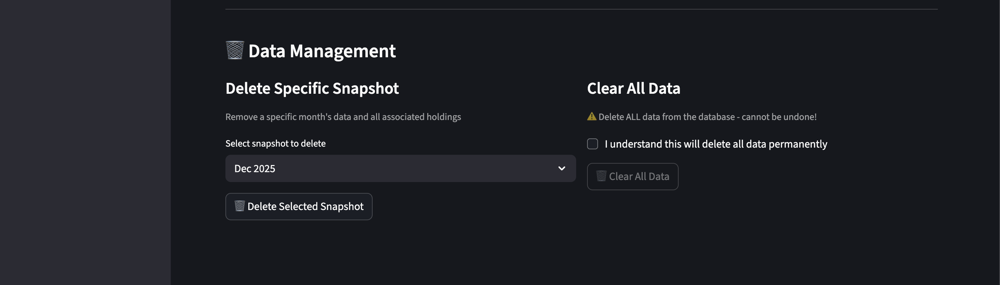

**Data Management Options:**
- Delete specific snapshots by month
- Clear all data (with confirmation)
- View recent upload history

### Step 2: View Dashboard

Go to the **Dashboard** page to see your portfolio overview:

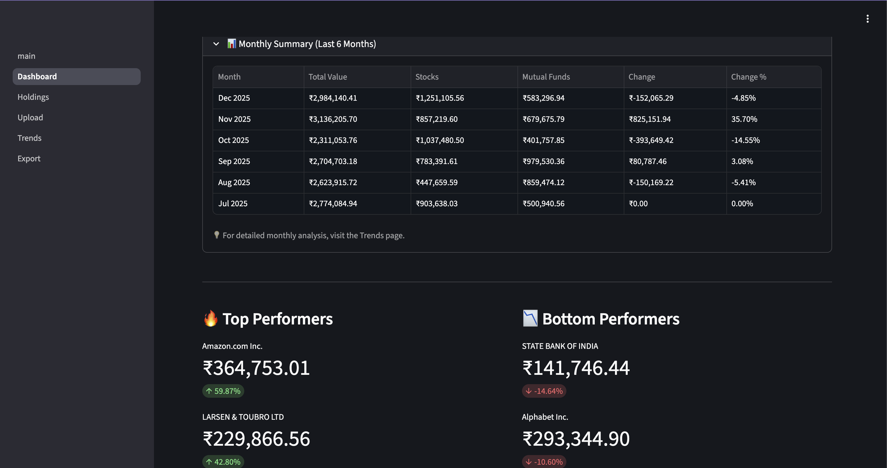

**Dashboard Features:**
- Portfolio value, invested amount, and total P&L
- Asset allocation pie chart (Indian stocks, US stocks, mutual funds)
- 6-month portfolio value trend
- Monthly growth comparison

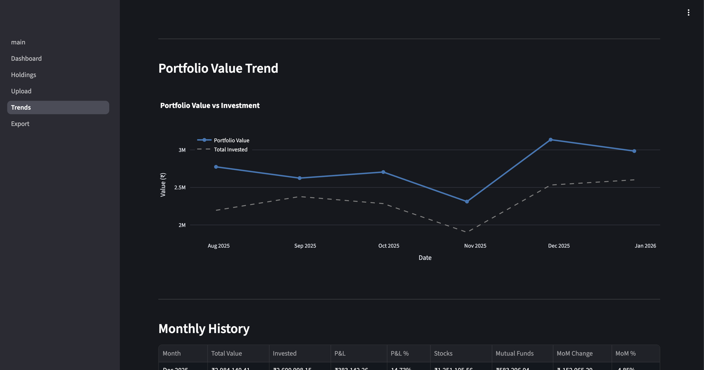

**Performance Tracking:**
- Historical value trends over time
- Invested vs current value comparison
- Month-over-month growth visualization

### Step 3: Explore Holdings

Visit the **Holdings** page to analyze your investments:

**Indian Stocks Tab:**

- All Indian stock holdings with live prices
- P&L tracking per stock
- Sortable by value, returns, or symbol

**US Stocks Tab:**

- US stock holdings with automatic USD to INR conversion
- Real-time exchange rate application
- Symbol-based tracking (AAPL, MSFT, NVDA, etc.)

**Mutual Funds Tab:**

- All mutual fund holdings
- NAV tracking and XIRR calculation
- Scheme-wise performance

**All Holdings Tab:**

- Unified view of all assets
- Filter and sort across asset types
- Export-ready comprehensive table

## Project Structure

```
investment-tracker-v2/
├── app/
│   ├── Home.py                 # Streamlit main page
│   └── pages/
│       ├── 1_Dashboard.py      # Dashboard with charts
│       ├── 2_Holdings.py       # Detailed holdings view
│       ├── 3_Upload.py         # File upload interface
│       ├── 4_Trends.py         # Portfolio trends & analytics
│       ├── 5_Export.py         # Export to Excel
│       └── 6_Crypto.py         # Crypto wallet management & scanning
├── src/
│   ├── database/
│   │   ├── models.py           # SQLAlchemy models
│   │   └── repository.py       # Data access layer
│   ├── parsers/
│   │   ├── stocks.py           # Indian stocks parser
│   │   ├── mutual_funds.py     # Mutual funds parser
│   │   └── us_stocks.py        # US stocks parser (DriveWealth)
│   ├── services/
│   │   ├── portfolio.py        # Portfolio calculations
│   │   ├── pricing.py          # Yahoo Finance integration
│   │   ├── benchmarks.py       # Nifty/Sensex data
│   │   └── crypto.py           # Crypto/DeFi position scanning
│   └── exports/
│       └── excel_exporter.py   # Excel export functionality
├── screenshots/                # README screenshots
├── data/
│   ├── uploads/                # Uploaded Excel files
│   ├── exports/                # Generated reports
│   └── portfolio.db            # SQLite database
├── Dockerfile
├── docker-compose.yml
├── pyproject.toml
├── ape-config.yaml            # Ape framework chain configuration
└── DATA_FORMAT_SPECIFICATION.md  # Detailed file format guide
```

## Security & Privacy

### Before Pushing to GitHub

Always verify no sensitive data is staged:
```bash
git status
git diff --staged
```

If you accidentally staged sensitive files:
```bash
git reset HEAD <file>
```

## Database Schema

### Holdings Table
Stores individual holdings per snapshot for all asset types:

| Column | Type | Description |
|--------|------|-------------|
| `id` | Integer | Primary key |
| `snapshot_date` | DateTime | Date of the snapshot |
| `type` | Enum | Asset type: `stock`, `us_stock`, `mutual_fund`, `crypto` |
| `name` | String | Asset name |
| `symbol` | String | Ticker symbol (stocks only) |
| `isin` | String | ISIN code (Indian stocks & MF) |
| `units` | Float | Quantity/units held |
| `avg_price` | Float | Average purchase price (INR) |
| `invested_value` | Float | Total cost basis (INR) |
| `current_price` | Float | Current price per unit (INR) |
| `current_value` | Float | Current market value (INR) |
| `unrealized_pl` | Float | Profit/Loss amount (INR) |
| `unrealized_pl_pct` | Float | P&L percentage |

### Snapshots Table
Monthly portfolio summaries with aggregated metrics:

| Column | Type | Description |
|--------|------|-------------|
| `snapshot_date` | DateTime | Unique date identifier (primary key) |
| `total_value` | Float | Total portfolio value (INR) |
| `stocks_value` | Float | Indian stocks value (INR) |
| `mf_value` | Float | Mutual funds value (INR) |
| `us_stocks_value` | Float | US stocks value (INR) |
| `total_invested` | Float | Total cost basis (INR) |
| `total_pl` | Float | Total P&L (INR) |
| `total_pl_pct` | Float | Total P&L percentage |
| `benchmark_nifty` | Float | NIFTY 50 index value |
| `benchmark_sensex` | Float | SENSEX index value |
| `crypto_value` | Float | Crypto/DeFi positions value (INR) |

### Upload Logs Table
Audit trail of all file uploads:

| Column | Type | Description |
|--------|------|-------------|
| `id` | Integer | Primary key |
| `upload_date` | DateTime | Upload timestamp |
| `snapshot_date` | DateTime | Data snapshot date |
| `filename` | String | Uploaded file name |
| `file_type` | String | `stocks`, `us_stocks`, `mutual_funds` |
| `records_count` | Integer | Number of holdings uploaded |
| `status` | String | `success` or `failed` |

### Wallet Addresses Table
Stores Ethereum wallet addresses for crypto tracking:

| Column | Type | Description |
|--------|------|-------------|
| `id` | Integer | Primary key |
| `address` | String(42) | Ethereum address (0x...) |
| `label` | String | User-friendly name |
| `chains` | String | Comma-separated chains to scan |
| `is_active` | Boolean | Whether to include in scans |
| `created_at` | DateTime | When wallet was added |
| `last_scanned` | DateTime | Last scan timestamp |

## Supported File Formats

This application supports three types of portfolio data uploads. For comprehensive format specifications, see [DATA_FORMAT_SPECIFICATION.md](DATA_FORMAT_SPECIFICATION.md).

### 1. Indian Stocks Excel File
**Source**: Indian broker holdings statements (Zerodha, Upstox, Groww, etc.)

**Expected columns:**
- `Stock Name`, `ISIN`, `Quantity`, `Average buy price`, `Buy value`, `Closing price`, `Closing value`, `Unrealised P&L`

**Requirements:**
- Row 3 must contain date in format: "Holdings statement for stocks as on DD-MM-YYYY"
- All monetary values in INR
- Valid ISIN codes required

### 2. US Stocks Excel File
**Source**: DriveWealth Profit-Loss statement

**Expected sheets:**
- **User Details**: Contains period date range (YYYY-MM-DD to YYYY-MM-DD)
- **Unrealized P&L - Summary**: Holdings data with columns below

**Expected columns:**
- `Security`, `Quantity`, `Cost Basis (USD)`, `Market Value (USD)`, `Profit/Loss (USD)`, `Profit/Loss (%)`

**Features:**
- **Automatic USD to INR conversion** using Yahoo Finance real-time exchange rate
- 5-minute rate caching for performance
- Fallback rate: ₹83.00/USD if API unavailable

### 3. Mutual Funds Excel File
**Source**: Broker mutual fund holdings statements

**Expected columns:**
- `Scheme Name`, `AMC`, `Category`, `Units`, `Invested Value`, `Current Value`, `Returns`, `XIRR`

**Requirements:**
- All monetary values in INR
- NAV and XIRR values for performance tracking

---

**Note:** All parsers output a standardized format with 11 columns (type, name, symbol, isin, units, avg_price, invested_value, current_price, current_value, unrealized_pl, unrealized_pl_pct). All monetary values are stored in INR for consistency.

## Development

### Run Tests
```bash
uv run pytest
```

### Code Quality
```bash
uv run ruff check src/
```

## Troubleshooting

### Database Issues
If you encounter database errors, delete the database and re-upload:
```bash
rm data/portfolio.db
```

### Port Already in Use
If port 8501 is busy:
```bash
uv run streamlit run app/Home.py --server.port=8502
```

### Import Errors
Ensure you're in the project root and using uv:
```bash
cd investment-tracker-v2
uv sync
```

### Exchange Rate Fetch Failed
If USD to INR conversion fails:
- **Check Internet Connection**: Yahoo Finance API requires internet access
- **Fallback Rate**: Application automatically uses ₹83.00/USD as fallback
- **Manual Override**: Edit `src/services/pricing.py` line 113 to set your preferred fallback rate

### Data Corruption
If data appears incorrect after upload:
1. Check the Excel file format matches specifications in [DATA_FORMAT_SPECIFICATION.md](DATA_FORMAT_SPECIFICATION.md)
2. Delete the problematic snapshot using the "Delete Specific Snapshot" feature
3. Re-upload with corrected file

## Future Enhancements

- [ ] Gold/Precious metals tracking
- [ ] Fixed deposits & bonds support
- [ ] Google Sheets integration
- [ ] Automatic scheduled data refresh
- [ ] Tax harvesting suggestions (STCG/LTCG)
- [ ] Goal tracking & SIP recommendations
- [ ] Dividend tracking
- [ ] Historical exchange rate tracking
- [ ] Streamlit Cloud deployment

## License

MIT License

---

**Last Updated**: January 2026
